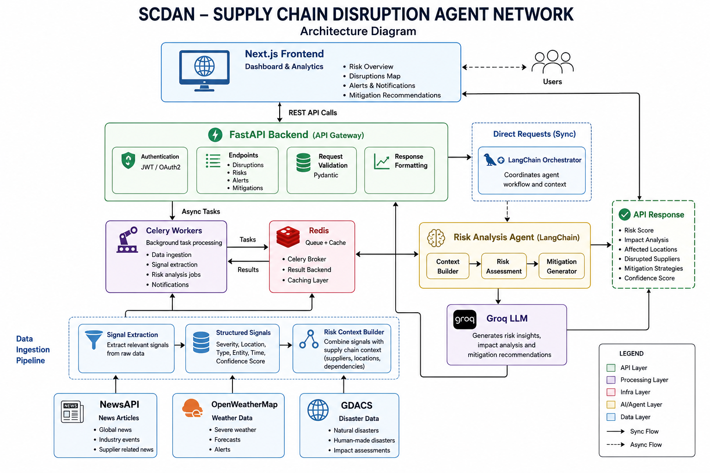

# SCDAN — Supply Chain Disruption Agent Network

Real-time supply chain risk intelligence using concurrent AI agents, LLM reasoning, and a graph-based supply chain model.

---

## Demo Video


---

## Architecture Diagram



---

## What it does

1. User builds a supply chain graph (nodes + edges)
2. Clicks **Run Scan**
3. Three agents run **concurrently**: News (NewsAPI), Weather (OpenWeatherMap), Disasters (GDACS)
4. LangChain + Groq classifies each signal, maps it to affected nodes, generates reroute suggestions
5. Alerts appear live on the graph with severity coloring
6. Analytics page shows trends + AI executive summary

---

## Tech stack

| Layer | Tech |
|---|---|
| Backend | FastAPI, SQLAlchemy 2.0, Pydantic v2, Loguru |
| AI | LangChain (LCEL), Groq (`llama-3.3-70b-versatile`) |
| Queue | Celery + Redis |
| Database | PostgreSQL (Neon) |
| Frontend | Next.js 15, Tailwind CSS, React Flow, Recharts |
| Auth | Bearer JWT (no cookies) |

---

## Local setup (Docker Compose)

### 1. Clone and configure

```bash
git clone <repo>
cd scdan
cp backend/.env.docker backend/.env.docker
# Fill in your API keys in backend/.env.docker
```

Required keys in `backend/.env.docker`:

```
SECRET_KEY=<random string>
GROQ_API_KEY=
NEWSAPI_KEY=
OPENWEATHERMAP_KEY=
```

`DATABASE_URL` and `REDIS_URL` are pre-configured for the Docker services.

### 2. Run

```bash
docker compose up --build
```

| Service | URL |
|---|---|
| Frontend | http://localhost:3000 |
| Backend API | http://localhost:8000 |
| API docs | http://localhost:8000/docs |

---

## Local setup (manual)

### Backend

```bash
cd backend
python -m venv .venv && source .venv/bin/activate
pip install -r requirements.txt

cp .env.example .env
# Fill in .env

uvicorn main:app --reload
```

### Celery worker (separate terminal)

```bash
cd backend
source .venv/bin/activate
celery -A app.workers.celery_app worker --loglevel=info --pool=solo
```

### Frontend

```bash
cd frontend
npm install
cp .env.local.example .env.local
# Set NEXT_PUBLIC_API_URL=http://localhost:8000
npm run dev
```

---

## Key API endpoints

| Method | Path | Description |
|---|---|---|
| POST | `/api/auth/register` | Register |
| POST | `/api/auth/login` | Login → Bearer token |
| GET | `/api/auth/me` | Current user |
| GET | `/api/supply-chains` | List supply chains |
| POST | `/api/supply-chains` | Create supply chain |
| POST | `/api/supply-chains/{id}/nodes` | Add node |
| POST | `/api/supply-chains/{id}/edges` | Add edge |
| POST | `/api/scans` | Trigger scan |
| GET | `/api/scans/{id}` | Scan status + timing |
| GET | `/api/alerts/{supply_chain_id}` | Alerts |
| GET | `/api/analytics/summary` | Global stats |
| GET | `/api/analytics/summary/executive` | AI executive summary |
| GET | `/api/analytics/{supply_chain_id}` | Per-chain stats |
| GET | `/api/analytics/{supply_chain_id}/executive` | Per-chain AI summary |

All protected routes require `Authorization: Bearer <token>`.

---

## Demo flow

1. Register at `/register`
2. Create a supply chain at `/dashboard`
3. Add nodes (supplier → factory → port → warehouse)
4. Add edges between them
5. Click **Run Scan**
6. Watch alerts appear on the graph in real time
7. Check **Analytics** tab for severity breakdown + executive summary

---

## Project structure

```
scdan/
├── backend/
│   ├── app/
│   │   ├── agents/
│   │   │   ├── ingestion/          # news, weather, disaster agents
│   │   │   ├── orchestrator.py     # concurrent pipeline runner
│   │   │   ├── risk_analysis_agent.py
│   │   │   ├── supply_chain_mapper_agent.py
│   │   │   └── reroute_agent.py
│   │   ├── api/routes/             # FastAPI routes
│   │   ├── core/                   # config, db, security, logging
│   │   ├── models/                 # SQLAlchemy models
│   │   ├── schemas/                # Pydantic schemas
│   │   ├── services/               # analytics, summary, graph utils
│   │   └── workers/                # Celery app + tasks
│   ├── main.py
│   ├── Dockerfile
│   └── requirements.txt
├── frontend/
│   ├── app/                        # Next.js App Router pages
│   ├── components/                 # React components
│   │   └── analytics/              # Chart components
│   └── lib/                        # API client, hooks, types
├── docker-compose.yml
└── README.md
```
